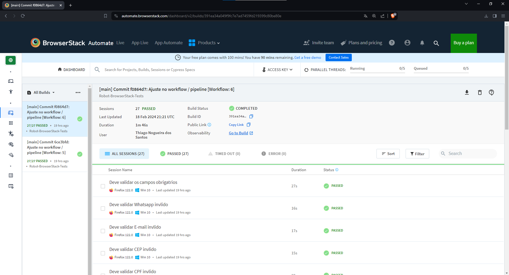
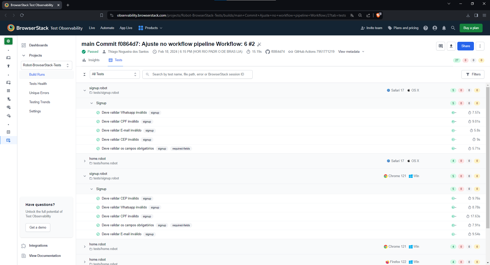

# Projeto de testes E2E com Robot Framework e Selenium WebDriver.

[](https://github.com/thinogueiras/Robot-Selenium-BrowserStack/actions/workflows/continuous-testing.yml) [](https://github.com/thinogueiras/Robot-Selenium-BrowserStack/actions/workflows/browserstack-testing.yml)

## Pré-requisitos mínimos de ambiente:

* [Python](https://www.python.org/downloads/) 3.11.x.

* [Node.js](https://nodejs.org/en) 18.17.x.

## Instalação do projeto:

```
pip install -r requirements.txt
```

## Setup BrowserStack (Opcional):

```
browserstack-sdk setup --framework "robot" --username "<YOUR_BROWSERSTACK_USERNAME>" --key "<YOUR_BROWSERSTACK_ACCESS_KEY>"
```

## Execução dos testes - Local 🤖 🤖

* ### Normal:

    ```
    robot -d ./reports tests/
    ```

*   ### Headless:

    ```
    robot -d ./reports -v BROWSER:headlesschrome tests/
    ```

## Execução dos testes - BrowserStack 🤖 🤖

*   ```
    browserstack-sdk robot -d ./reports -e ignore-bs tests/
    ```

---

## Relatórios 📝 📄

Verifique a pasta `reports` para visualizar os <b>relatórios</b> da execução: `report.html` ou `log.html`.

---

## Sobre a integração com o BrowserStack:

<p>
    
</p>

### Execuções disparadas automaticamente pelo pipeline do GitHub Actions:



### Observabilidade dos Testes:



---

<a href="https://www.linkedin.com/in/thinogueiras"></a>

<strong>Thiago Nogueira dos Santos</strong> 🤓 ✌🏻

QA Automation Engineer 🔎 🐞

